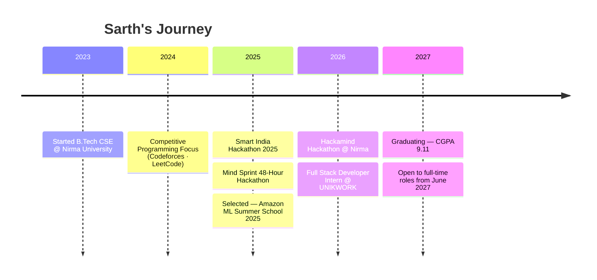

<a name="readme-top"></a>
<div align="center">

<!-- ANIMATED HEADER -->


<!-- WAVING HAND -->

<b>Hey, I'm Sarth — welcome to my corner of GitHub!</b>

<br/><br/>

<!-- TYPING ANIMATION -->
[](https://git.io/typing-svg)

<br/>

<!-- SOCIAL BADGES -->
<a href="https://linkedin.com/in/sarth-narola-223002323"></a>
<a href="https://github.com/Sarth00718"></a>
<a href="mailto:sarthnarola018@gmail.com"></a>
<a href="https://codeforces.com/profile/sarthnarola007"></a>
<a href="https://leetcode.com/u/__sarth_narola_007/"></a>
<a href="https://www.codechef.com/users/mds_007"></a>

<br/><br/>


&nbsp;


</div>


<!-- QUICK NAV -->
<div align="center">

**📍 Quick Navigate:** &nbsp;
<a href="#-about-me">About</a> •
<a href="#️-tech-arsenal">Skills</a> •
<a href="#-experience">Experience</a> •
<a href="#-core-full-stack--ai-projects">Projects</a> •
<a href="#-hackathon--innovation-projects">Hackathons</a> •
<a href="#-achievements--certifications">Achievements</a> •
<a href="#️-journey-timeline">Timeline</a> •
<a href="#-github-analytics">Stats</a> •
<a href="#-lets-connect">Contact</a>

</div>


##  About Me


```yaml
Name:       Sarth Narola
Location:   Surat, Gujarat, India
Education:  B.Tech in Computer Engineering — Nirma University (2023–2027) | CGPA: 9.11
Focus:      Full Stack Development • AI/ML Integration • Competitive Programming
Status:     🟢 Open to Full-time & Internship opportunities from June 2027
```

<table>
<tr>
<td width="50%" valign="top">

### 🎯 Quick Highlights

- 🏫 **Amazon ML Summer School '25** — Selected Participant
- 💼 **Full Stack Developer Intern** @ UNIKWORK (2026)
- 🏆 **Smart India Hackathon 2025, Mind Sprint (IronXman), Hackamind**
- ⭐ **CodeChef 2★** Rated Competitive Programmer
- 🔬 Building **AI-powered full stack applications** with RAG pipelines
- 🎓 Final-year student with **9.11 CGPA**

</td>
<td width="50%" valign="top">

### ⚡ What I'm Up To

- 🔭 Building production-grade **MERN + AI** applications
- 🌱 Exploring **RAG pipelines, LangChain, and vector databases**
- 🤝 Open to **internships & full-time collaborations** on innovative products
- 💬 Ask me about **MERN Stack, DSA, AI Integration**
- 📩 Reach me at **sarthnarola018@gmail.com**

</td>
</tr>
</table>

<br clear="right"/>

<div align="right"><a href="#readme-top">⬆ Back to top</a></div>


## 🛠️ Tech Arsenal

<div align="center">

### At a Glance


</div>

<br/>

<details open>
<summary><b>🔤 Languages</b></summary>
<br/>
<div align="center">


</div>
</details>

<details>
<summary><b>🎨 Frontend</b></summary>
<br/>
<div align="center">


</div>
</details>

<details>
<summary><b>⚙️ Backend & Databases</b></summary>
<br/>
<div align="center">


</div>
</details>

<details>
<summary><b>🧠 Machine Learning & AI</b></summary>
<br/>
<div align="center">


</div>
</details>

<details>
<summary><b>🔧 Tools & Platforms</b></summary>
<br/>
<div align="center">


</div>
</details>

<div align="right"><a href="#readme-top">⬆ Back to top</a></div>


## 💼 Experience

<table>
<tr>
<td width="100%">

### 🏢 Full Stack Developer Intern — UNIKWORK
**May 2026 – June 2026 · Surat, Gujarat, India**

Worked on the **UNIKWORK Dashboard**, a production-level project management platform used for task tracking and business workflow management, collaborating closely with senior frontend and backend developers in an agile environment.

- 🧩 Built production-ready **React.js + Next.js** components with a scalable, reusable architecture
- 🔌 Integrated REST APIs across project, client, employee, asset, task, and auth modules
- 📋 Built dynamic task management features: board view, list view, task detail, and updates
- 🔍 Implemented filtering, searching, sorting, pagination, and server-side data handling
- 📱 Fixed responsive design issues across desktop, tablet, and mobile with pixel-perfect layouts
- 🐞 Debugged frontend/backend issues, resolved API integration bugs, optimized performance
- 🤝 Collaborated daily through code reviews, feature discussions, and debugging sessions

`React.js` `Next.js` `TypeScript` `Tailwind CSS` `Node.js` `Express.js` `REST APIs` `Git` `Postman`

</td>
</tr>
</table>

<div align="right"><a href="#readme-top">⬆ Back to top</a></div>


## 📂 Core Full-Stack & AI Projects

<table>
<tr>
<td width="50%" valign="top">

### 🤖 FinChatBot
**AI Chatbot for Financial Document Analysis**


- 🔗 RAG pipeline built with **LangChain + FAISS**
- 🧠 Dual AI: **Groq LLM + Google Gemini**
- ⚡ Real-time **WebSocket** chat
- 📄 Works with **PDF, Excel, and CSV** files
- 🔐 JWT auth keeps uploaded documents secure

[🔗 Repo](https://github.com/Sarth00718/Financial-Chatbot-) · [🚀 Live](https://financial-chabot.vercel.app/)

</td>
<td width="50%" valign="top">

### 💰 Smart Expense Tracker
**Personal Finance Tracker with AI Insights**


- 🗣️ AI **conversational finance assistant**
- 📸 **OCR** receipt scanning with Tesseract
- 📊 Spending analytics with a health score
- 📱 PWA-ready, works smoothly on mobile

[🔗 Repo](https://github.com/Sarth00718/Smart-Expense-Tracker) · [🚀 Live](https://smart-expense-tracker-rho-eight.vercel.app/)

</td>
</tr>
<tr>
<td width="50%" valign="top">

### 👗 Vastra
**Full MERN Stack Clothing Store**


- 💳 **Razorpay** payment integration
- 🔐 **Firebase** email & social authentication
- 🛍️ Cart, wishlist, and order tracking
- 📋 Admin panel for product & stock management

[🔗 Repo](https://github.com/Sarth00718/Vastra-cloth-shop) · [🚀 Live](https://vastra-cloth-shop-oirs.vercel.app/login)

</td>
<td width="50%" valign="top">

### 💬 Real-Time Chat App
**MERN WebSocket Messaging App**


- 📡 Real-time messaging with **Socket.io**
- 🔄 State managed with **Redux Toolkit**
- 👥 Group chats and private one-on-one chats
- ☁️ Hosted on **MongoDB Atlas**

[🔗 Repo](https://github.com/Sarth00718/Real-Time-Chat-Application) · [🚀 Live](https://real-time-chat-application-eosin.vercel.app)

</td>
</tr>
</table>

<div align="right"><a href="#readme-top">⬆ Back to top</a></div>


## 🚀 Hackathon & Innovation Projects

<table>
<tr>
<td width="100%">

### 🍽️ SmartBite — AI-Powered Meal Planner & Nutrition Assistant
> 🏆 *Mind Sprint 48-Hour International Hackathon (IronXman, Unstop)*

<div align="center">

| Feature | Description |
|:---|:---|
| 🤖 AI Recommendations | Personalized meal suggestions via collaborative filtering & ML |
| 📊 Nutrition Analysis | Real-time macro tracking & dietary goal monitoring |
| 📅 Weekly Optimization | Meal planning respecting dietary restrictions |
| 💬 AI Chat Assistant | Groq AI-powered nutrition advisor |
| 🎯 K-Means Clustering | Meal diversity optimization to avoid repetition |
| 🛒 Smart Grocery Lists | Automated & budget-aware list generation |
| 🌗 Dark/Light Mode | Responsive UI with PWA offline support |

</div>

[🔗 Repo](https://github.com/Sarth00718/SmartBite)

</td>
</tr>
</table>

<table>
<tr>
<td width="50%" valign="top">

### 🎬 ClipCrafters
**Turn Documents into Videos with AI**
> 🏅 *Innovation Award — National Hackathon 2025*

- 📄 Parses PDF, DOCX, PPTX, and TXT uploads
- 🔗 RAG pipeline with **FAISS + SentenceTransformers**
- ✍️ Groq LLM writes the video script
- 🎞️ Script rendered into video via **MoviePy**
- 🗣️ Murf TTS voiceover in multiple voices
- 🎨 Scene visuals generated with Stability.ai
- ☁️ Delivered fast via **Cloudinary CDN**

[🔗 Repo](https://github.com/Sarth00718/ClipCrafters)

</td>
<td width="50%" valign="top">

### 🚛 FleetFlow
**Fleet & Logistics Management System**
> *Built in a 72-hour development sprint*

- 🗄️ **PostgreSQL**-based relational backend
- 🔐 Role-based access for drivers, managers, admins
- 📍 Live GPS tracking with geofence alerts
- 💹 Finance dashboard with INR & tax breakdowns
- 🔑 REST API with JWT auth & rate limiting

[🔗 Repo](https://github.com/Sarth00718/FleetFlow) · [🚀 Live](https://fleet-flow-amber.vercel.app/)

</td>
</tr>
<tr>
<td width="50%" valign="top" colspan="2">

### 💼 Exe$Man
**Multi-Level Expense Approval & Management System**

- 📸 OCR receipt scanning — no manual entry
- ✅ Configurable multi-level approval workflows
- 🔔 Real-time approval notifications
- 📊 Department-wise budget vs. spend reports
- 🚩 Auto-categorization with policy-violation flags

[🔗 Repo](https://github.com/Sarth00718/Expense-Management) · [🚀 Live](https://expense-management-gamma.vercel.app/)

</td>
</tr>
</table>

<div align="right"><a href="#readme-top">⬆ Back to top</a></div>


## 🧪 Machine Learning Projects

<table>
<tr>
<td align="center" width="33%">

### 🍷 Wine Quality Prediction
**14 ML Models Compared**

`XGBoost` · `LightGBM` · `CatBoost`

Feature engineering, stratified K-fold CV, and ensemble stacking.

[🔗 Repo](https://github.com/Sarth00718/Wine-Quality-Prediction)

</td>
<td align="center" width="33%">

### ❤️ Heart Attack Risk Prediction
**Clinical Risk Classification**

`KNN` · `Logistic Regression` · `Decision Trees`

SMOTE for class imbalance, ROC-AUC evaluation.

[🔗 Repo](https://github.com/Sarth00718/heart-attack-prediction)

</td>
<td align="center" width="33%">

### 🌍 Global Superstore Analytics
**51K+ Record Retail Dataset**

`Decision Tree` · `Regression` · `K-Means` · `Tableau`

Sales forecasting + interactive dashboards.

[🔗 Repo](https://github.com/Sarth00718/Data-Analysis-and-Visualization-of-Global_Superstore-Dataset)

</td>
</tr>
</table>

<div align="right"><a href="#readme-top">⬆ Back to top</a></div>


## 🧩 DSA & Core CS Projects

<div align="center">

| 📁 Project | 🔧 Tech Stack | 📝 Description |
|:---|:---|:---|
| **[Tournament Graph Scheduling System](https://github.com/Sarth00718/Tournament-Graph-Scheduling-System)** | Python · FastAPI · NetworkX · React · D3.js | Welsh-Powell graph coloring + Dijkstra for conflict-free, travel-optimized tournament scheduling |
| **[Greedy Algorithm Visualizer](https://github.com/Sarth00718/Greedy-Algorithm-Stimulation)** | JavaScript · Canvas | Step-by-step visualization of Activity Selection, Huffman Coding & Fractional Knapsack |
| **[Torrent Power Billing System](https://github.com/Sarth00718/DSA-LL-Electricity-Billing-System)** | C++ · OOP · File Handling | Utility billing with automated calculations and persistent storage |
| **[Library Management System](https://github.com/Sarth00718/Library-Management-System---Java)** | Java · OOP · File I/O | Complete CRUD with issue/return tracking and fine calculation |

</div>

<div align="right"><a href="#readme-top">⬆ Back to top</a></div>


## 🏅 Achievements & Certifications

<div align="center">

| | Achievement | Detail |
|:---|:---|:---|
| 🏅 | **Amazon ML Summer School 2025** | Selected — supervised & deep learning, NLP, PGMs, recommendation systems |
| 🇮🇳 | **Smart India Hackathon 2025** | Built an AI-based solution for a national problem statement |
| ⚡ | **Mind Sprint Hackathon — IronXman** | 48-hour national hackathon on Unstop — full-stack AI project |
| 💡 | **Hackamind Hackathon** | Nirma University — rapid prototyping under time pressure |
| 🎬 | **ClipCrafters — Innovation Award** | National Hackathon 2025 |
| 🎓 | **CGPA 9.11** | B.Tech Computer Engineering — Nirma University |

</div>

<div align="right"><a href="#readme-top">⬆ Back to top</a></div>


## 🗺️ Journey Timeline

<div align="center">



</div>

<div align="right"><a href="#readme-top">⬆ Back to top</a></div>


## 💡 Competitive Programming

<div align="center">

<a href="https://www.codechef.com/users/mds_007">

</a>
&nbsp;
<a href="https://codeforces.com/profile/sarthnarola007">

</a>
&nbsp;
<a href="https://leetcode.com/u/__sarth_narola_007/">

</a>

<br/><br/>

| Platform | Handle | Status |
|:---:|:---:|:---:|
|  | [mds_007](https://www.codechef.com/users/mds_007) | ⭐⭐ (2-Star) |
|  | [sarthnarola007](https://codeforces.com/profile/sarthnarola007) | Active |
|  | [__sarth_narola_007](https://leetcode.com/u/__sarth_narola_007/) | Active |

<br/>


</div>

<div align="right"><a href="#readme-top">⬆ Back to top</a></div>


## 📊 GitHub Analytics

<div align="center">

<a href="https://github.com/Sarth00718">

</a>
&nbsp;&nbsp;
<a href="https://github.com/Sarth00718">

</a>

<br/><br/>

<a href="https://github.com/Sarth00718">

</a>
&nbsp;&nbsp;
<a href="https://github.com/Sarth00718">

</a>

<br/><br/>

<!-- STREAK STATS (animated counters) -->
<a href="https://github.com/Sarth00718">

</a>

<br/><br/>

<a href="https://github.com/Sarth00718">

</a>

</div>

### 🏆 GitHub Trophies

<div align="center">

<a href="https://github.com/Sarth00718">

</a>

</div>

### 🐍 Contribution Snake (Animated)

<div align="center">

<picture>
  <source media="(prefers-color-scheme: dark)" srcset="https://raw.githubusercontent.com/Sarth00718/Sarth00718/output/github-contribution-grid-snake-dark.svg" />
  <source media="(prefers-color-scheme: light)" srcset="https://raw.githubusercontent.com/Sarth00718/Sarth00718/output/github-contribution-grid-snake.svg" />
  
</picture>

<sub>🔧 Renders once the <code>snake.yml</code> workflow below runs on the <code>Sarth00718/Sarth00718</code> repo — see setup steps.</sub>

</div>

<details>
<summary>⚙️ <b>One-time setup: enable the animated snake above</b></summary>

1. In your **`Sarth00718/Sarth00718`** profile repo, create `.github/workflows/snake.yml` with:

```yaml
name: Generate Snake

on:
  schedule:
    - cron: "0 */6 * * *"
  workflow_dispatch: {}
  push:
    branches: [ main ]

jobs:
  generate:
    permissions:
      contents: write
    runs-on: ubuntu-latest
    steps:
      - uses: Platane/snk@v3
        id: snake
        with:
          github_user_name: Sarth00718
          outputs: |
            dist/github-contribution-grid-snake.svg
            dist/github-contribution-grid-snake-dark.svg?palette=github-dark

      - uses: crazy-max/ghaction-github-pages@v4
        with:
          target_branch: output
          build_dir: dist
        env:
          GITHUB_TOKEN: ${{ secrets.GITHUB_TOKEN }}
```

2. Push it — the action runs automatically and publishes the SVGs to an `output` branch.
3. The image links above will then render live.

</details>

<div align="right"><a href="#readme-top">⬆ Back to top</a></div>


## 📈 Contribution Graph

<div align="center">

<a href="https://github.com/Sarth00718">

</a>

</div>

<div align="center">

### ✍️ Random Dev Quote


</div>

### 🔝 Top Contributed Repos

<div align="center">


</div>

<div align="right"><a href="#readme-top">⬆ Back to top</a></div>


## 🌀 Let's Connect

<div align="center">

**💼 Open to full-time & internship opportunities — available from June 2027**

📩 **[sarthnarola018@gmail.com](mailto:sarthnarola018@gmail.com)** · 🔗 **[LinkedIn](https://linkedin.com/in/sarth-narola-223002323)** · 🐙 **[GitHub](https://github.com/Sarth00718)**

<br/>

[](https://visitcount.itsvg.in)

<br/>


*⭐ If you find my work interesting, consider giving a star!*

</div>

<!-- FOOTER WAVE -->

